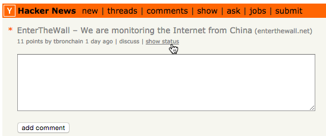
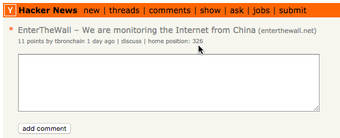
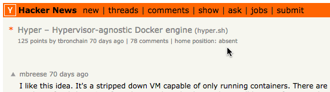

# hn-status
See the current home page status of a post on [Hacker News](http://news.ycombinator.com)

This is especially useful if you are publishing a post, and would like to track its current ranking,
without constantly searching for it.

## Installation
You can install the Chrome extention, by downloading it from the [Chrome Web Store](https://chrome.google.com/webstore/detail/hn-status/edmbgdfejjdikhaniepceopkchejaghp).

## Usage
Access a post page, for example by clicking on the comment(s) number (or "discuss") link, under a post name, from [HN homepage](http://news.ycombinator.com)

(date, or direct link work as well).

When on a Hacker News post page (e.g. https://news.ycombinator.com/item?id=10014045),
a new "show status" link will be added.

Click on this link in order to display the current article's position

If the post is no longer on HN homepage, "absent" will be displayed

To update the current position, simply reclick on the "home position" link.

That's All Folks!

## Issues
If you encounter any issue using this extension, don't hesitate to create a Github issue [here](https://github.com/tbronchain/hn-status/issues).

## Contributions
[Pull Requests](https://github.com/tbronchain/hn-status/pulls) are much welcome :)

## License
Copyright (c) 2015 [Thibault Bronchain](http://bronchain.me)
